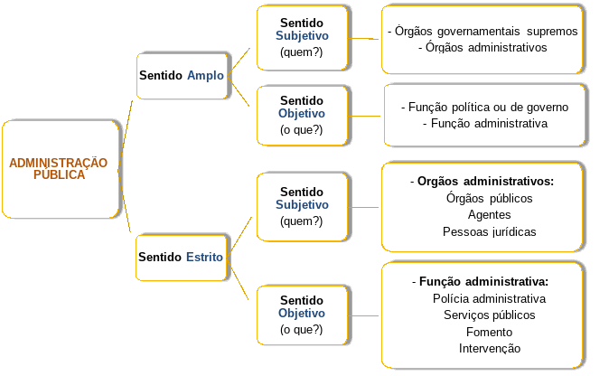

# Direito Administrativo

## Log
18.03.21 - Aula Demonstrativa - Estado, Gov e Adm Pública
22.03.21 - Aula Demonstrativa - Direito Administrativo

## Edital 2014
- [ ] 1. Conceito de administração pública sob os aspectos orgânico, formal e material.
- [ ] 2. Fontes do Direito Administrativo: doutrina e jurisprudência, lei formal, regulamentos administrativos, estatutos e regimentos, instruções, tratados internacionais, costumes. Princípios da administração pública.
- [ ] 3. Administração pública direta e indireta. Órgãos e entidades. Centralização e descentralização da atividade administrativa do Estado. Empresas públicas e sociedades de economia mista. Subsidiárias. Participação do Estado no capital de empresas privadas. Autarquias e fundações públicas. Consórcios públicos.
- [ ] 4. Terceiro Setor.
- [ ] 5. Agentes públicos. Servidores públicos em sentido amplo e em sentido restrito. Servidores públicos temporários. Servidores públicos federais estatutários. Empregados públicos. Disciplina constitucional dos agentes públicos. Legislação federal aplicável aos agentes públicos.
- [ ] 6. Improbidade administrativa.
- [ ] 7. Atos administrativos. Requisitos de validade. Atributos. Classificações. Convalidação. Extinção. Atos privados praticados pela administração pública. Fatos administrativos.
- [ ] 8. O processo administrativo em âmbito federal.
- [ ] 9. Poderes administrativos.
- [ ] 10. Licitações públicas e contratos administrativos. Sistema de Registro de Preços. Sistema de Cadastramento Unificado de Fornecedores. Pregão presencial e eletrônico e demais modalidades de licitação. Instrução Normativa SLTI/MP nº 02, de 2008 e atualizações posteriores. Contratação de micro empresas e empresas de pequeno porte. Regime diferenciado de contratações públicas, Instrução Normativa SLTI/MP nº 05 de 07 de novembro de 2013 e alterações posteriores. Margem de preferência nas contratações públicas. Contratos de repasse. Convênios. Termos de cooperação. Acordos, em sentido amplo, celebrados pela administração pública federal com órgãos ou entidades públicas ou privadas. Portaria Interministerial CGU/MF/MP nº 507/2011 e atualizações posteriores. Diretrizes da Comissão Gestora do SICONV
- [ ] 11. Serviços públicos. Concessão, permissão e autorização de serviços públicos. Parcerias público-privadas. 12. Bens públicos. Regime jurídico. Classificações. Uso de bens públicos por particulares. Uso privativo dos bens públicos. 
- [ ] 13. Intervenção do Estado na propriedade privada.
- [ ] 14. Responsabilidade civil do Estado.
- [ ] 15. Controle da administração pública.
- [ ] 16. Sistemas administrativos.
- [ ] 17. Ética Profissional do Servidor Público. Sistema de Gestão da Ética do Poder Executivo Federal. Conflito de Interesses no Serviço Público.
- [ ] 18. Acesso à Informação em âmbito federal. Política de Segurança da Informação no âmbito da Receita Federal do Brasil.

## Anotações

### Três poderes

> Legislativo
**Função Típica**: Legislar (criar leis)
**Função Atípica**: Administrativa (organiza serviços internos e gere seus bens, pessoas e serviços) e Jurisdicional (julgar o presidente e ministros do STF por crimes de responsabilidade)

> Judiciário
**Função Típica**: Julgar (aplicar leis para solucionar conflitos)
**Função Atípica**: Administrativa (organiza serviços internos e gere seus bens, pessoas e serviços) e Legislativa (elaborar regimento interno dos tribunais)

> Executivo
**Função Típica**: Administrar (executar as leis)
**Função Atípica**: Legislativa (cria decretos, regulamentos, medidas provisórias e leis delegadas)
*Não exerce função jurisdicional, apenas sem definitividade

### Sentidos

#### - Sentidos da Administração Pública

|         | Subjetivo (QUEM)                        | Objetivo (O QUE)                 |
| ------- | --------------------------------------- | -------------------------------- |
| Amplo   | Órgãos governamentais e administrativos | Função Política e Administrativa |
| Estrito | Pessoas Jurídicas, Órgãos e Agentes     | Atividades exercidas por entes   |

> Sentido estrito
O conceito de administração pública envolve todo o aparelhamento estatal voltado à execução das políticas públicas.

> Sentido Amplo
Abrangendo os órgãos superiores de governo que exercem função política, da mesma forma que os órgãos, agentes e entidades que exercem função meramente administrativa

> Sentido formal, subjetivo ou orgânico (QUEM)
Conjunto de órgãos, agentes e pessoas jurídicas aos quais a lei atribui o exercício da função administrativa do Estado

> Sentido material, objetivo ou funcional (O QUE)
Abrange as atividades exercidas pelas pessoas jurídicas, órgãos e agentes incumbidos da função administrativa do Estado
- Polícia administrativa
- Serviço público
- Fomento
- Intervenção

#### - Sentidos de Governo

**Em sentido formal:** é o conjunto de Poderes e órgãos constitucionais;
**Em sentido material:** é o complexo de funções estatais básicas;
**Em sentido operacional:** é a condução política dos negócios públicos.

#### - Fontes de Direito Administrativo
- Lei - **em sentido amplo** é a **mais importante** fonte do Direito Administrativo. (princípio da legalidade)
Exemplos de normas de Direito Administrativo relevantes, podem-se citar: **artigos 37 a 41 da Constituição Federal**, que apresentam disposições gerais sobre a Administração Pública e os servidores públicos; **artigos 70 a 75 da Constituição Federal**, que versam sobre o controle da Administração Pública; **artigos 173 a 180 da Constituição Federal**, que disciplinam as diversas formas de intervenção do Estado na atividade econômica; **Lei 8.112/1990**, que estabelece o regime jurídico dos servidores públicos federais estatutários; **Lei 8.666/1993**, sobre normas gerais de licitações e contratos; **Lei 9.784/1994**, que trata das normas gerais aplicáveis aos processos administrativos federais; **Decreto 2.594/1998**, que dispõe sobre o Programa Nacional de Desestatização, regulamentando a **Lei 9.491/1997**; **Instrução Normativa 5/2017**, que dispõe sobre regras e diretrizes para a contratação de serviços,  dentre outras normas.
Também consideram os tratados e acordos internacionais como fontes de Direito Administrativo (ex. **Decreto 5.687/2006**).
- Doutrina - formulam **teses** e **teorias**, considerada **fonte secundária**, **indireta** ou **subsidiária**
- Jurisprudência -  nasce de **reiteradas decisões** semelhantes a respeito de determinada matéria, também considerada **fonte secundária**, **indireta** ou **subsidiária**
A jurisprudência, em regra, **não vincula** a Administração ou o próprio Judiciário, NO ENTANTO, as decisões do STF sobre **ações integrantes do controle abstrato de normas** - Ação direta de inconstitucionalidade, ação direta de inconstitucionalidade por omissão, ação declaratória de constitucionalidade e arguição de descumprimento de preceito fundamental - produzem **eficácia contra todos** e **efeito vinculante**, além das **súmulas vinculantes**, também aprovadas pelo STF.
- Costumes - considerados fontes não organizadas ou não escritas e assim como a Jurisprudência e a Doutrina, são **fontes secundárias**, **indiretas** ou **subsidiárias**
  
#### - Sistemas Administrativos
Forma adotada pelo Estado para solucionar os litígios decorrentes da sua atuação
##### - Sistema francês ou do contencioso administrativo
_Dualidade de jurisdição_
O Poder Judiciário não pode intervir nas funções administrativas
**Não é adotado no Brasil**

##### - Sistema inglês ou de jurisdição única
Todos os litígios podem ser levados ao Poder Judiciário - _princípio da inafastabilidade (ou inarredabilidade) de jurisdição_
**Adotado no Brasil**

_Em regra, o exaurimento das instâncias administrativas para o exercício do controle jurisdicional não é necessário, porém, existem situações em que o exaurimento deve ocorrer para que se possa acionar o Judiciário._

> Nosso Direito Administrativo é não contencioso, uma vez que as lides de natureza administrativa podem ser levadas à apreciação do Poder Judiciário.